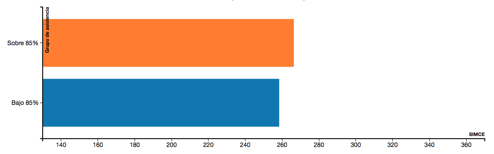
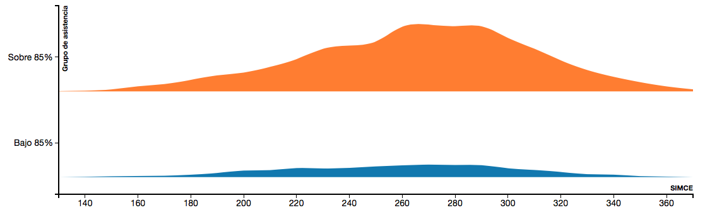
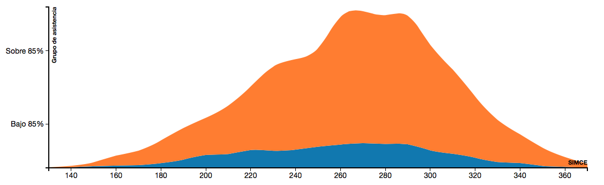

tide-angular-blanket
====================

Tide-Angular directive for displaying curves that represent frequencies of metrics (scores) in the population. There are 3 types of representations:

i) Bar: horizintal bars for each category representing the average score for the category


ii) Parallel curves: parallel area charts - for each category -  that represent the frequency of dubjects with each score


iii) Stacked curves: similar to parallel curves but curves are stacked one on top of the other


Input data format:
-----------------
```javascript
[
{"category":"A", "x": 200, "size": 5},
{"category":"A", "x": 210, "size": 23},
...
{"category":"B", "x": 200, "size": 1},
{"category":"B", "x": 210, "size": 17},
...
]
```

Directive use:
-------------
```html
<div td-blanket 
td-data="controller.data" 
td-category-attribute="'category'" 
td-x-attribute="'x'" 
td-size-attribute="'size'" 
td-sort-criteria="controller.sortCriteria" 
td-chart-type="controller.chartType" 
td-x-label="'SIMCE'" 
td-y-label="'Grupo de asistencia'">
</div>
```

| Attribute        | Description           | Example  |
| ------------- |-------------| -----|
| td-data      | Data array with distribution specification | [{"category":"A", "x":10, "size":17, ...}] |
| td-category-attribute      | Name of the attribute used to specify the category      |   "category" |
| td-x-attribute      | Name of the attribute used to specify the x value (or score)      |   "x" |
| td-size-attribute      | Name of the attribute used to specify the size (number of subjects with this score)     |   "x" |
| td-sort-criteria      | Functions used to sort categories     |   function(d) {return d} |
| td-chart-type      | Type of chart to be displayed (can be changed once in place)     |  "bars"\|"parallel curves"|"stacked curves" |
| td-x-label      | Label used to identify x axis |  "Score" |
| td-y-label      | Label used to identify y axis (categories)     | "Asistencia" |


